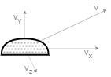

# Virtual robotics

The Virtual Robotics library provides a set of APIs for constructing simple 
virtual robots. In this document all times are in seconds, all sizes are in
meters, all angles are in radians and all indices start from 0.


* **[USER GUIDE](#user-guide)**<small>
	* **[Building a robot](#building-a-robot)**<small><br>
	  &ndash; [installation](#installation)<br>
	  &ndash; [simple robot](#simple-robot)<br>
	  &ndash; [options](#options)</small>
	  <br>
	  <br>
* **[INVENTORY](#inventory)**
	* **[Robotic hands](#robotic-hands)**<small>:[`EdgedHand`](#edgedhand), [`RoundHand`](#roundhand), [`AnthroHand`](#anthrohand)<br>
	  &ndash; [hands control](#hands-control): [`flexFinger`](#flexfinger), [`flexFingers`](#flexfingers), [`spreadFinger`](#spreadfinger), [`spreadFingers`](#spreadfingers)</small>
	* **[General parts](#general-parts)**<small><br> 
	  &ndash; [common shapes](#common-shapes): [`Ball`](#ball), [`Box`](#box), [`Label`](#label) ([`setText`](#settext), [`addText`](#addtext))<br>
	  &ndash; [external shapes](#external-shapes): [`GLTFPart`](#gltfpart), [`recolor`](#recolor)<br>
	  &ndash; [motors](#motors): [`MotorX`](#motorx), [`MotorY`](#motory), [`MotorZ`](#motorz)</small>
	* **[Hand parts](#hand-parts)**<small><br>
	  &ndash; [edged hand](#edged-hand): [`EdgedFinger`](#edgedfinger), [`EdgedTip`](#edgedtip), [`EdgedPalm`](#edgedpalm)<br>
	  &ndash; [round hand](#round-hand-2): [`RoundFinger`](#roundfinger), [`RoundPalm`](#roundpalm)<br>
	  &ndash; [anthropomorphic hand](#anthropomorphic-hand): [`AnthroThumb`](#anthrothumb), [`AnthroPalm`](#anthropalm)</small>
	  <br>
	  <br>
* **[API REFERENCE](#api-reference)**
	* **[Scene API](#scene-api)**<small>: [`getScene`](#getscene)<br>
	  &ndash; [`setAnimation`](#setanimation), [`getTime`](#gettime), [`setVR`](#setvr)<br>
	  &ndash; [`setCameraPosition`](#setcameraposition), [`setCameraTarget`](#setcameratarget)</small>
	* **[Robot API](#robot-api)**:<small> [`Robot`](#robot)<br>
	  &ndash; [`attachChain`](#attachchain), [`addChain`](#addchain), [`addGUI`](#addgui)<br>
	  &ndash; [`getParts`](#getparts), [`getMotors`](#getmotors), [`getSensors`](#getsensors)<br>
	  &ndash; [`getPosition`](#getposition), [`setPosition`](#setposition), [`setRotation`](#setrotation), [`setScale`](#setscale)<br>
	  &ndash; [`getAngle`](#getangle), [`setAngle`](#setangle), [`getAngles`](#getangles), [`setAngles`](#setangles)<br>
	  &ndash; [`getProperty`](#getproperty), [`setProperty`](#setproperty)</small>
	* **[Part API](#part-api)**:<small> [`Part`](#part)<br>
	  &ndash; [`addSlot`](#addslot), [`attachToSlot`](#attachtoslot)<br>
	  &ndash; [`setPosition`](#setposition-1), [`setRotation`](#setrotation-1)<br>
	  &ndash; [`getProperty`](#getproperty-1), [`setProperty`](#setproperty-1)<br>
	  &ndash; [`beginContact`](#begincontact), [`endContact`](#endcontact)</small>
	* **[Motor API](#motor-api)**:<small> [`Motor`](#motor), [`setName`](#setname)<br>
	  &ndash; [`getAngle`](#getangle-1), [`setAngle`](#setangle-1), [`flip`](#flip)</small>
	* **[Slot API](#slot-api)**:<small> [`Slot`](#slot)<br>
	  &ndash; [`setPosition`](#setposition-2), [`setRotation`](#setrotation-2)</small>
	* **[Sensor API](#sensor-api)**:<small> [`Sensor`](#sensor)<br>
	  &ndash; [`senseDistance`](#sensedistance), [`senseTouch`](#sensetouch), [`sensePosition`](#senseposition), [`senseDirection`](#sensedirection)<br>
	  &ndash; [`senseCollision`](#sensecollision), [`senseObjects`](#senseobjects), [`senseObject`](#senseobject)<br>
	  &ndash; [`senseSpeed`](#sensespeed), [`senseVelocity`](#sensevelocity), [`senseAccelerationMagnitude`](#senseaccelerationmagnitude), [`senseAcceleration`](#senseacceleration), [`senseProperty`](#senseproperty)</small>


# User guide

The Virtual Robotics library allows construction of virtual robots from a
JavaScript program. The robots can be viewed and manipulated on desktop and
mobile platforms. The library is base on the following main concepts:

* [**Scene**](#scene-api) – a virtual environment where robots are placed and controlled;
* [**Robot**](#robot-api) – a virtual mechanism constructed programmatically of sevral parts;
* [**Part**](#part-api) – a building element of a robot &ndash; a shape, a motor or a sensor;
* [**Motor**](#motor-api) – a robot part that can be rotated around a predefined axis;
* [**Slot**](#slot-api) – a place on a robot part to which another elements can be attached;
* [**Sensor**](#sensor-api) – a robot part that can sense its environment and generate feedback.

<center></center>


## Building a robot


> ### Installation

**Virtual Robotics** is distributed as a single JavaScript file called
`virtual-robotics.js`. It does not require any specific installation. The
library file could be placed anywhere within the project folder tree or hosten
on a CORS-enabled repository. 


The library provides its functionality via modules and it is used within a
module script:


```html
<script type="module">
	// JS code
</script>
```

The library is loaded (and activated) via `import` statement. The following
example assumes the library is in current folder:

```js
import * as Robotic from "./virtual-robotics.js";
```

If the library is activated, it prints the text **Virtual Robotics 1.0** in
the console. Activation creates a virtual scene with the Virtual Robotics
logo spinning in the center:

[<kbd></kbd>](../examples/empty-scene.html)


> ### Simple robot

This section describes the construction of a simple robot in several steps. The robot contains three parts and three motors, so that each part can be rotated.


The robot will be constructed in several steps:
* Step 1 &ndash; HTML page
* Step 2 &ndash; Robot definition
* Step 3 &ndash; Robot animation
* Step 4 &ndash; Optional customization
* Step 5 &ndash; Optional encapsulation


#### Step 1 &ndash; HTML page

The first step is to create the main HTML page. It should have `<!DOCTYPE html>`
at the very top to indicate this is a HTML5 page. The JavaScript source code is
in `<script>` tag inside the main `<body>` tag. The library is loaded with an
`import` statement, so that all definitions are accessed through `Robotic.`
prefix. The following code create an empty scene:

```html
<!DOCTYPE html>

<body>
	<script type="module">

		import * as Robotic from "../build/virtual-robotics.js";

		// robot definition
		// robot animation
		
	</script>
</body>
```


#### Step 2 &ndash; Robot definition

Robots are defined as instances of [`Robotic.Robot`](#robot) class. The simple
robot, that is being built, contains 6 elements &ndash; three motors and three
robot parts. Motors are elements that implement rotation. For the simple robot
rotation is around Z axis, so all three motors are [`Robotic.MotorZ`](#motorz)
instances. The three robot parts are [`Robotic.EdgedFinger`](#edgedfinger).

To join all elements in a robot they are attached into a chain with the robot's
method `attachChain`. The following code build the robots as the chain 
*(robot)&rarr;motor&rarr;finger&rarr;motor&rarr;finger&rarr;motor&rarr;finger*.

```html
var robot = new Robotic.Robot;
	robot.attachChain(
			new Robotic.MotorZ,
			new Robotic.EdgedFinger,
			new Robotic.MotorZ,
			new Robotic.EdgedFinger,
			new Robotic.MotorZ,
			new Robotic.EdgedFinger,
		);
```

The result is a static robot. The motors are shown as short black cylinders
between robot parts:

[<kbd></kbd>](../examples/docs-simple-robot-1.html)


#### Step 3 &ndash; Robot animation

The animation in Virtual Robotics is implemented by a loop function that
is called each animation frame &ndash; this usually happens 60 times per second
and is controlled by the browser. This function has a parameter with the
current time, measured since the initialization of the library. What function is
used as a loop function is defined with [`Robotic.setAnimation`](#setanimation).

Robots are animated by changing the angles of rotation in their motors. The
robot's method [`setAngles`](#setangles) sets the angles of all motors &ndash;
the order of angles in the method corresponds to the order of motors in the
robot construction.

In the following example the first motor is rotated from -0.7 and 0.7 radians.
The other two motors are rotated from -1.6 to 0 radians:

```js
Robotic.setAnimation( loop );

function loop( t )
{
	robot.setAngles( 
		-0.7*Math.sin(t),
		-1.6*(0.5 + 0.5*Math.sin(t)),
		-1.6*(0.5 + 0.5*Math.sin(t))
	);
}
```

[<kbd></kbd>](../examples/docs-simple-robot-2.html)


#### Step 4 &ndash; Optional customization

Most elements in Virtual Robotics can be customized with a set of optional
parameters. For examples, motors may have allowed range of rotation as well as
visual sizes. SImilarily, fingers's proportions can also be changed.

The following example uses differen sizes of robot parts:

```js
new Robotic.MotorZ( -0.7, 0.7, 0, 0.2, 0.6 ),
new Robotic.EdgedFinger( 1, 1, 0.1 ),
new Robotic.MotorZ( -1.6, 0, 0, 0.4, 0.3 ),
new Robotic.EdgedFinger( 2 ),
new Robotic.MotorZ( -1.6, 0, 0, 0.4, 0.2 ),
new Robotic.EdgedFinger( 0.7, 0.1 ),
```

and different animation that resembles digging motion:

```js
robot.setAngles( 
	-0.7*Math.sin(2*t+3),
	-1.6*(0.5 + 0.5*Math.sin(2*t+1)),
	-1.6*(0.5 + 0.5*Math.sin(2*t))
);
```

[<kbd></kbd>](../examples/docs-simple-robot-3.html)


#### Step 5 &ndash; Optional encapsulation

Robot encapsulation is the proces of packing robot structure and behaviour in
a class. In this way it is easy to create many robots of this kind (i.e. 
instances of this class).

The following code creates class `Digger` which is a `Robotic.Robot`. Its
constructor chains customized motors and robot parts and stores the `speed`
parameter &ndash; it is how fast is the robot. The class has method `dig` which
implements the digging motion for specific time and speed.

```js
class Digger extends Robotic.Robot
{
	constructor( speed )
	{
		super( );
		
		this.speed = speed;
		this.attachChain(
			new Robotic.MotorZ( -0.7, 0.7, 0, 0.2, 0.6 ),
			new Robotic.EdgedFinger( 1, 1, 0.1 ),
			new Robotic.MotorZ( -1.6, 0, 0, 0.4, 0.3 ),
			new Robotic.EdgedFinger( 2 ),
			new Robotic.MotorZ( -1.6, 0, 0, 0.4, 0.2 ),
			new Robotic.EdgedFinger( 0.7, 0.1 ),
		);
	}
	
	dig( time )
	{
		time = time * this.speed;
		
		this.setAngles( 
			-0.7*Math.sin(time+3),
			-1.6*(0.5 + 0.5*Math.sin(time+1)),
			-1.6*(0.5 + 0.5*Math.sin(time))
		);
	}
}
```

Once the `Digger` class is defined, it can be used to create several robots,
each with its own digging speed. The method `setPosition` is used to separate
the robots, otherwise they all be created at position (0,0,0).

```js
var robotA = new Digger(2);
var robotB = new Digger(3);
var robotC = new Digger(4);

robotA.setPosition( 0, 0, 1 );
robotC.setPosition( 0, 0, -1 );

Robotic.setAnimation( loop );

function loop( t )
{
	robotA.dig( t );
	robotB.dig( t );
	robotC.dig( t );
}
```


[<kbd></kbd>](../examples/docs-simple-robot-4.html)


> ### Options

Some run-time aspects of the library can be controlled by URL parameters (also
called [query strings](https://en.wikipedia.org/wiki/Query_string)). Some of the
parameters are pairs of **name=vaue**, others are just flags and are only
**name**.

* `touch-color=‹color-name›`

	Controls the emissive color indication of colliding parts. Any [CSS color name](https://www.w3schools.com/tags/ref_colornames.asp) can be used, but dark
	colors have minimal or no effect. For example, `touch-color=crimson` adds a
	pale pinkinsh color to parts, while `touch-color=black` does not produce any
	effect.

* `debug-physics`

	Shows how the physics engine "sees" the parts. Each part has an invisible
	convex envelope that is used for collision testing. If th flag `debug-physics`
	is used, the edges of the envelope are shown. By default they are hidden.

* `show-slots`

	Shows the positions and orientations of all slots. By default slots are hidden.


Example:
```
../examples/two-hands.html?touch-color=crimson&debug-physics&show-slots
```

[<kbd></kbd>](https://boytchev.github.io/virtual-robotics/examples/two-hands.html?touch-color=crimson&debug-physics&show-slots)


# INVENTORY


## Robotic hands

The Virtual Robotics defines three variants of robotic hands &ndash; edged,
round and anthropomorphic.


> ### EdgedHand

```js
EdgedHand( isLeft )
```

Class. Defines an edged hand robot made of [edged hand parts](#edged-hand). If
`isLeft` is `true`, the a left hand is constructed, otherwise &ndash; a right hand.

Example:

```js
hand = new Robotic.EdgedHand( true );
```

[<kbd></kbd>](../examples/docs-edged-hands.html)

Source code: [src/robots/edged-hand.js](https://github.com/boytchev/virtual-robotics/blob/main/src/robots/edged-hand.js)


> ### RoundHand

```js
RoundHand( isLeft )
```

Class. Defines a round hand robot made of [round hand parts](#round-hand). If
`isLeft` is `true`, the a left hand is constructed, otherwise &ndash; a right hand.

Example:

```js
hand = new Robotic.RoundHand( true );
```

[<kbd></kbd>](../examples/docs-round-hands.html)

Source code: [src/robots/round-hand.js](https://github.com/boytchev/virtual-robotics/blob/main/src/robots/round-hand.js)


> ### AnthroHand

```js
AnthroHand( isLeft )
```

Class. Defines an anthropomorphic hand robot made of [round hand parts](#round-hand)
and  [anthropomorphic hand parts](#anthropomorphic-hand). It extnds the [RoundHand](#roundhand),
with additional parts for finer thumb motion. If `isLeft` is `true`, the a left
hand is constructed, otherwise &ndash; a right hand.

Example:

```js
hand = new Robotic.AnthroHand( true );
```

[<kbd></kbd>](../examples/docs-anthro-hands.html)

Source code: [src/robots/anthro-hand.js](https://github.com/boytchev/virtual-robotics/blob/main/src/robots/anthro-hand.js)


## Hands control

The edged, round and anthropomorphic hands can be controlled like other robots
&ndash; individual motors can be set. The hands control provide additional
options for control by setting a group of motors.


> ### flexFinger

```js
flexFinger( index, angle )
```

Method. Flexes a selected finger &ndash; the thumb has `index` 0, the index finger
is 1, etc. The `angle` is applied to all motors in the finger, that are used for
flexing.


Example:

```js
hand.flexFinger( 1, 0.5 );
```


> ### flexFingers

```js
flexFingers( angle )
```

Method. Flexes all fingers by given `angle`.

Example:

```js
hand.flexFingers( 0.5 );
```


> ### spreadFinger

```js
spreadFinger( index, angle )
```

Method. Spreads a selected finger &ndash; the thumb has `index` 0, the index finger
is 1, etc. The `angle` is applied only to the base motor of the finger.


Example:

```js
hand.spreadFinger( 3, 0.1 );
```


> ### spreadFingers

```js
spreadFingers( angle, includeThumb )
```

Method. Spread all fingers by given maximal `angle`. If `includeThumb` is `true`,
the thumb is also spread, otherwise only the rest 4 fingers are spread.

Example:

```js
hand.spreadFingers( 0.5, false );
```


## General parts

The general parts are predefined [parts](api.md#parts-api) that have images. Some
robot parts also have invisible physics envelopes that are used the the physics
engine for collision detection.


### Common shapes

Shapes are robot parts without motors. They can be positioned with
[setPosition](api.md#setposition-1) and rotated with [setRotation](api.md#setrotation-1).
Common shapes have exact physics envelopes and the engine uses them for precise
collision detection. 

Source code: [src/parts/shapes.js](https://github.com/boytchev/virtual-robotics/blob/main/src/parts/shapes.js)


> #### Ball

```js
Ball( )
Ball( radius )
Ball( radius, color )
```

Class. Defines a ball shape with optional `radius` (by default 1) and `color` (by
default [DimGray](https://www.w3schools.com/colors/color_tryit.asp?color=DimGray)).
The ball has no slots.


Example:

```js
part = new Robotic.Ball( 2 );
```


> #### Box

```js
Box( )
Box( sizex, sizey, sizez )
Box( sizex, sizey, sizez, color )
```

Class. Defines a box shape with optional sizes along its axes `sizex`, `sizey` and
`sizez` (by default all sizes are 1), and `color`(by default DimGray). The box
has no slots.


Example:

```js
part = new Robotic.Box( 2, 1, 2 );
```


> #### Label

```js
Label( text )
Label( text, sizex, sizey )
Label( text, sizex, sizey, color )
```

Class. Defines a rectangular shape with text label on it and optional sizes
along its axes `sizex` and `sizey` (by default 1 and 0.25), and background
`color`(by default White). The label has no slots.


Example:

```js
note = new Robotic.Label( 'Entry point' );
```

Two methods are used to draw text on a label: [setText](#settext) and [addText](#addtext):

> #### setText

```js
setText( text, x, y, font )
```

Method. Clears a label and draws `text` on it at pixel coordinates `x` and `y`
(by default 10). The font, size and color of the text is defined as a [CSS style](https://developer.mozilla.org/en-US/docs/Web/CSS/font)
string in `font`. By default the style is `'bold 48px Arial'`.

Example:

```js
note.setText( 'Counter 1', 10, 10, 'bold 48px Arial' );
```

> #### addText

```js
addText( text, x, y, font )
```

Method. Draws `text` (without clearing the label) on it at pixel coordinates `x`
and `y` (by default 10). The font, size and color of the text is defined as a
[CSS style](https://developer.mozilla.org/en-US/docs/Web/CSS/font) string in
`font`. By default the style is `'bold 48px Arial'`.

Example:

```js
note.setText( 'Counter 1', 10, 10, 'bold 48px Arial' );
note.addText( 'Counter 2', 10, 60, '24px Arial' );
```


### External shapes

Complex shapes of robot parts can be designed with external tools like
[Blender](https://www.blender.org/) and provided as
[GLTF or GLB files](https://en.wikipedia.org/wiki/GlTF).


Source code: [src/parts/gltf.js](https://github.com/boytchev/virtual-robotics/blob/main/src/parts/gltf.js)


> #### GLTFPart

```js
GLTFPart( filename )
GLTFPart( filename, length )
GLTFPart( filename, length, callback )
```

Base class. Defines a robot part with shape loaded from GLTF or GLB file with
URL in `filename`. The GLTF part has no slots. The `length` parameter (by
default it is 0) sets the intended length of the shape, so center of rotation of
the part is shifted down by `length/2` from the center of the shape.

A GLTF model ia loaded asynchronously. The optional `callback` parameter is a
function that is called when the model is loaded. The part has no physics
envelope and no slots. A part that extends GLTFPart may add its own envelope
and slots.


Example:

```js
part = new Robotic.GLTFPart( 'myshape.glb', 2 );
```

> #### recolor

```js
gltf.recolor( fromColor, toColor, eps )
```

Method of GLTFPart. Changes the color of each vertex from `fromColor` to
`toColor`. Optional parameter `eps` defines how precise to check `fromColor`.
By default it is 0.01. Colors can be changed only after the 3D model is loaded
and `recolor` can be used in a `callback` function.


### Motors

Robot motors are extensions of [motor](api.md#motor) class with predefined axis
of rotation and image. The motors have no physics envelopes and the engine
ignores them during collision detection. 

Source code: [src/motor.js](https://github.com/boytchev/virtual-robotics/blob/main/src/motor.js)


> #### MotorX

```js
MotorX( min, max, def )
MotorX( min, max, def, width, height )
```

Class. Defines a motor that rotates around the X axis. The available range for
the rotation is from `min` to `max`. The initial value is `def`. The motor is
drawn as a cylinder with sizes `width` and `height` (by default width=0.1 and
height=0.05). Slot 0 is at the center of the motor.


Example:

```js
motor = new Robotic.MotorX( 0, Math.PI, Math.PI/2 );
```


> #### MotorY

```js
MotorY( min, max, def )
MotorY( min, max, def, width, height )
```

Class. Defines a motor that rotates around the Y axis. The available range for
the rotation is from `min` to `max`. The initial value is `def`. The motor is
drawn as a cylinder with sizes `width` and `height` (by default width=0.1 and
height=0.05). Slot 0 is at the top of the motor.


Example:

```js
motor = new Robotic.MotorY( 0, Math.PI, Math.PI/2 );
```


> #### MotorZ

```js
MotorZ( min, max, def, width=0.1, height=0.05 )
```

Class. Defines a simple motor that rotates around the Z axis. The available
range for the rotation is from `min` to `max`. The initial value is `def`.
The motor is drawn as a cylinder with sizes `width` and `height`. Slot 0 is at
the center of the motor.


Example:

```js
motor = new Robotic.MotorZ( 0, Math.PI, Math.PI/2 );
```


## Hand parts

Hands parts are predefined robot parts that are used to build antropomorphic
robots resembling a human hand. Hands parts are: a finger, a finger tip, and
a palm. A more advanced version of the hand is the anthropomorphic hand that
contains additional part: a thumb.

 


### Edged hand

The edged hand parts are convex polyhedra with straight edges. The main
properties of edged hand parts are:

* easily resized, preserving the overall shape
* simple shapes, less computationally intensive
* generated on-the-fly without external resources
* relatively high precision of collision detection

Source code: [src/parts/edged-hand.js](https://github.com/boytchev/virtual-robotics/blob/main/src/parts/edged-hand.js)


> #### EdgedFinger

```js
EdgedFinger( )
EdgedFinger( length )
EdgedFinger( length, width, thickness )
```

Class. Defines an edged finger shape intended for attachment to Z-motor. The
optional parameters `length` (by default 1), `width` (by default 0.3) and
`thickness` (by default 0.3) define the size of the part. There is one slot
at the top at position (0,`length`,0).


Example:

```js
part = new Robotic.EdgedFinger( 1, 0.2, 0.2 );
```


> #### EdgedTip

```js
EdgedTip( )
EdgedTip( length )
EdgedTip( length, width, thickness )
```

Class. Defines a tip of an edged finger shape for attachment to Z-motor. The
optional parameters `length` (by default 1), `width` (by default 0.3) and
`thickness` (by default 0.3) define the size of the part. There are no slots.
The `EdgedTip` looks almost like `EdgedFinger`, but is intended to be the
last part of a chain of fingers. 


Example:

```js
part = new Robotic.EdgedTip( 1, 0.2, 0.2 );
```


> #### EdgedPalm

```js
EdgedPalm( left )
EdgedPalm( left, length )
EdgedPalm( left, length, width, thickness )
```

Class. Defines a shape for an edged palm. The palm exists in two symmetrical
shapes. If `left` is true, the palm is a left-hand palm, otherwise it is a
right-hand palm. The parameters `length` (by default 1.4), `width` (by default 1.4)
and `thickness` (by default 0.3) define the size of the palm. There are five
slots for attaching fingers, the slot for the thumb is 0.


Example:

```js
part = new Robotic.EdgedPalm( true, 1.5, 0.9, 0.3 );
```


### Round hand

The round hand parts are shaped like ellipsoids and have connectors for
attaching other round parts. The main properties of round hand parts are:

* fixed size, could be scaled proportionally
* smoother and more aesthetic appearance
* shapes provided from external GLTF files
* approximate precision of collision detection

Round hand parts as GLTF files use two colors &ndash; white (1,1,1) for the planar
surfaces and blue (0,0.21,1) for the curved surfaces. When files are loaded for
modeling a rounded hand, the blue color is changed to gray (0.3,0.3,0.3).

Source code: [src/parts/round-hand.js](https://github.com/boytchev/virtual-robotics/blob/main/src/parts/round-hand.js)


> #### RoundFinger

```js
RoundFinger( filename )
RoundFinger( filename, length )
```

Class. Defines a round finger shape intended for attachment to Z-motor. The
optional parameter `length` (by default 0.8) defines the intended length of the
palm. There is one slot at the top at position (0,`length`,0).

The round finger is used to model both a finger and a tip. The following example
defines the intended `length` value for the available GLTF file for round fingers:

| Part | GLTF file | Length |
| --- | --- | --- |
| Long finger | round-finger-8.glb | 0.8 |
| Short finger | round-finger-5.glb | 0.5 |
| Tip | round-tip.glb | 0.5 |

Example:

```js
part = new Robotic.RoundFinger( '../assets/gltf/round-finger-8.glb', 0.8 );
```


> #### RoundPalm

```js
RoundPalm( left, filename )
RoundPalm( left, filename, length )
```

Class. Defines a round palm. The palm exists in two symmetrical shapes. If
`left` is true, the palm is a left-hand palm, otherwise it is a right-hand palm.
Only the left palm exists as a GLTF model. The right palm is a mirror of the
left palm. The parameter `length` (by default 1.4) defines the intended size of
the palm. There are five slots for attaching round fingers, the slot for the
thumb is 0.

| Part | GLTF file | Length |
| --- | --- | --- |
| Palm | round-palm.glb | 1.4 |


Example:

```js
part = new Robotic.RoundPalm( true, '../assets/gltf/round-palm.glb' );
```


### Anthropomorphic hand

The anthropomorphic hand parts are extension to the round hand parts. They
provide more detailed shapes for thumbs. 

Source code: [src/parts/anthro-hand.js](https://github.com/boytchev/virtual-robotics/blob/main/src/parts/anthro-hand.js)


> #### AnthroThumb

```js
AnthroThumb( left, filename )
AnthroThumb( left, filename, length )
```

Class. Defines a round anthropomorphic thumb. The thumb exists in two symmetrical
shapes. If `left` is true, the thumb is a left-hand palthumb, otherwise it is a
right-hand thumb. Only the left thumb exists as a GLTF model. The right thumb is
a mirror of the left thumb. The optional parameter `length` (by default 1.4)
defines the intended length of the thumb. There is one slot at the top at
position (0,-0.2*`length`,0.06*`length`).


Example:

```js
part = new Robotic.AnthroThumb( true, '../assets/gltf/anthro-thumb.glb' );
```


> #### AnthroPalm

```js
AnthroPalm( left, filename )
AnthroPalm( left, filename, length )
```

Class. Defines a round anthropomorphic palm. The palm exists in two symmetrical
shapes. If `left` is true, the palm is a left-hand palm, otherwise it is a
right-hand palm. Only the left palm exists as a GLTF model. The right palm is a
mirror of the left palm. The parameter `length` (by default 1.4) defines the
intended size of the palm. There are five slots for attaching round fingers,
the slot for the thumb is 0.


Example:

```js
part = new Robotic.AnthroPalm( true, '../assets/gltf/anthro-palm.glb' );
```


# API REFERENCE

## Scene API

The Virtual Robotics library automatically creates a 3D scene that contains
all created robotic devices.

Source code: [src/scene.js](https://github.com/boytchev/virtual-robotics/blob/main/src/scene.js)


> ### setAnimation

```js
setAnimation( func, fps=30 )
```

Function. Defines a callback function `func` to be called `fps` times per second.
Higher `fps` (or frames-per-second) produces smoother motion, but consumes more
computational resources. The maximal value for `fps` is controlled by the
browser and is usually 60 or more.

The callback function has optional parameters `time` for the elapsed time since
the start of the library; and `dTime` for the elapsed time since the previous frame.


Example:

```js
Robotic.setAnimation( loop, 60 );

function loop( time, dTime )
{
   // one step of the animation
};
```


> ### getTime

```js
getTime( );
```

Function. Gets the current time since the initialization of the library. Inside
the animation loop, the time is available as a parameter.

Example:

```js
time = Robotic.getTime( );
```


> ### setVR

```js
setVR( rightHandRobot, leftHandRobot )
```

Function. Allows VR mode when a compatible VR device is present. Currently VR mode
is tested only with Meta Quest 2 headsets. The method adds [Enter VR] button and
when pressed, the user enters VR mode. The optional parameters `rightHandRobot`
and `leftHandRobot` are robots that are attached as controllers.

In VR mode the camera position and orientation is controlled by the headset, and
the attached robots positions and orientations are controlled by the controllers.

Example:

```js
Robotic.setVR( robotA, robotB );
```

While in VR mode the position of attached robots set by [`setPosition`](#setposition)
are relative to the controller position. The property `vr-reset-position` defines
whether the robot position is automatically reset when it is attached in VR mode.

In the following example, when robots are attached to controller in VR mode,
`robotA` position will be reset to (0,0,0), while `robotB` will preserve its
position (-0.3,0,0), but it will be relative to the controller.


```js
robotA.setPosition( -0.3, 0, 0 );
robotA.setProperty( 'vr-reset-position', true );

robotB = new Robotic.AnthroHand( true );
robotB.setPosition( 0.3, 0, 0 );
```

Navigation in VR mode is done with the Squeeze buttons &ndash; the right
controller moves the user forward along the direction of the controller, the
left controller moves the user backward.


> ### getScene

```js
getScene( );
```

Function. Gets the scene as a [`THREE.Scene`](https://threejs.org/docs/#api/en/scenes/Scene)
object that can be manipulated by [Three.js](https://threejs.org/), e.g. for
adding custom Three.js objects.

Example:

```js
scene = Robotic.getScene( );
```


> ### setCameraPosition

```js
setCameraPosition( position )
setCameraPosition( x, y, z )
```

Function. Places the camera at given `position` which is a list of coordinates
(`x,y,z`). The position can also be provided as three individual values.
Initially the camera is placed at (4,4,7). The camera position can be changed in
the animation loop to control its motion programmatically.

Example:

```js
position = [10, 2, 0];
Robotic.setCameraPosition( position );

Robotic.setCameraPosition( 10, 2, 0 );
```


> ### setCameraTarget

```js
setCameraTarget( target )
setCameraTarget( x, y, z )
```

Function. Turns the camera towards given `target` which is a list of coordinates
(`x,y,z`). The target can also be provided as three individual values.
Initially the camera target is (0,0,0). The camera target can be changed in the
animation loop to control its rotation programmatically.

Example:

```js
target = [0, 2, 0];
Robotic.setCameraTarget( target );

Robotic.setCameraTarget( 0, 2, 0 );
```


## Robot API

A robot is a mechanism made of various robot parts. Some parts are just 3D shapes,
others are motors or sensors.

Source code: [src/robot.js](https://github.com/boytchev/virtual-robotics/blob/main/src/robot.js)


> ### Robot

Base class. Defines the overall functionality of a robot. User-defined robots
are classes that extends this base class.

Example:

```js
class MyRobot extends Robotic.Robot
{
	constructor( )
	{
		super( );

		// definitions of robot parts
	}
}
```


> ### attachChain

```js
attachChain( part1, part2, ... )
```

Method. Used in the constructor of a custom robot to automatically connect parts
`part1`, `part2` and so on in a chain and attach this chain to the robot. Method
`attachChain(...)` is a shorthand for `addChain(this,...)`.

The result of the method is the last attached part.

Example:

```js
class MyRobot extends Robotic.Robot
{
	constructor( )
	{
		super( );

		var partA = ...;
		var partB = ...;
		
		this.attachChain( partA, partB );
	}
}
```

Attaching a chain always attaches parts to slot 0. If another slot or a custom
slot position is needed, use [`attachToSlot`](#attachtoslot). 


> ### addChain

```js
addChain( part1, part2, ... )
```

Method. Used in the constructor of a custom robot to automatically connect parts
`part1`, `part2` and so on in a chain. Method `addChain` is a shorthand
for a sequence of [`attachToSlot`](#attachtoslot). The variable `this` can be
used to mark the robot itself. If `this` is used in `addChain` it must be the
first parameter. At least one of the chains in a robot must start with `this`,
otherwise the robot parts will be unattached to the robot.

The result of the method is the last added part.

Example:

```js
class MyRobot extends Robotic.Robot
{
	constructor( )
	{
		super( );

		var partA = ...;
		var partB = ...;
		
		this.addChain( this, partA, partB );
	}
}
```

Adding a chain always attaches parts to slot 0. If another slot or a custom
slot position is needed, use [`attachToSlot`](#attachtoslot). 


> ### addGUI

```js
addGUI( title )
```

Method. Create interactive panel with all motors. The user can interactively
modify angles and export the gesture as a JavaScript command. The panel is made
with [lil-gui](https://lil-gui.georgealways.com/) library. The `title` is used
as a title of the controls. The default title is 'Robot'.

Motors with names set by [`setName`](#setname) are listed with their name. All
other motors are listed with their index.

Example:

```js
robot.addGUI( );
```

The GUI element of a robot is stored in property `gui`, which can be accessed to
modify the panel, e.g. to change the position:

```js
robot.gui.domElement.style = 'left: 0em';
```


> ### getParts

```js
getParts( )
```

Method. Gets a list of all robot parts, including motors.

Example:

```js
parts = robot.getParts( );
```


> ### getMotors

```js
getMotors( )
```

Method. Gets a list of all robot motors. The number of motors defines the
robot's DOF ([Degree of freedom](https://en.wikipedia.org/wiki/Degrees_of_freedom_(mechanics))) as each motor
can be manipulated independently on other motors.

Example:

```js
motors = robot.getMotors( );
```


> ### getSensors

```js
getSensors( )
```

Method. Gets a list of all robot sensors. 

Example:

```js
sensors = robot.getSensors( );
```


> ### getPosition

```js
getPosition( )
```

Method. Gets the position of a robot as a list of [**x, y, z**] coordinates.

Example:

```js
pos = robot.getPosition( );
```


> ### setPosition

```js
setPosition( position )
setPosition( x, y, z )
```

Method. Sets the position of a robot to `position` which is a list of 
coordinates (`x,y,z`). The position can also be provided as three individual
values. If no position is provided, the robot is removed from the scene, but it
is not deleted. The default position of a robot is (0,0,0).

Example:

```js
position = [0, 10, 5];
robot.setPosition( position );

robot.setPosition( 0, 10, 5 );
```


> ### setRotation

```js
setRotation( x, y, z, order='XYZ' )
```

Method. Sets the orientation of a robot defined by [Euler angles](https://threejs.org/docs/#api/en/math/Euler)
(`x,y,z`) and optional `order` of rotations.

Example:

```js
robot.setRotation( 0, Math.PI/2, 0 );
```


> ### setScale

```js
setScale( factor )
```

Method. Rescales a robot by given `factor`. This operation affects bothe the
image of the robot and the physics envelopes of its parts.

Example:

```js
robot.setScale( 0.2 );
```


> ### getAngle

```js
getAngle( index )
```

Method. Gets the angle of the `index`-th motor. If such motor does not exist,
the result is 0. Use [`getAngles`](#getangles) to get all angles at once.

Example:

```js
a = robot.getAngle( 1 );
```


> ### setAngle

```js
setAngle( index, angle )
```

Method. Sets the `angle` of the `index`-th motor. If such motor does not exist
or if the `angle` is `null`, the operation is ignored. Use
[`setAngles`](#setangles) to set all angles at once.

Example:

```js
robot.setAngle( 1, Math.PI );
```


### getAngles

```js
getAngles( )
```

Method. Gets an array with angles of all motors. Use [`getAngle`](#getangle) to
get an individual angle.

Example:

```js
a = robot.getAngles( );
```


### setAngles

```js
setAngles( angle1, angle2, ... )
```

Method. Sets the angles `angle1`, `angle2`, ... of all motors. If a value of
some angle is `null`, then the corresponding motor's angle is unchanged. Use
[`setAngle`](#setangle) to set an individual angle.

Example:

```js
robot.setAngles( Math.PI, 0, -Math.PI/2 );
```


> ### getProperty

```js
getProperty( name )
```

Method. Gets the value of a specific property `name` from the first part of the
robot. If such property is not set, the result is `undefined`. A property could
be any user-defined feature, like temperature, sound, color emission, etc. It is
up to the user program to process properties. 

Example:

```js
a = robot.getProperty( 'temperature' );
```


> ### setProperty

```js
setProperty( name, value )
```

Method. Sets the value of a specific property `name` to all parts of the robot.
A property could be any user-defined feature, like temperature, sound, color
emission, etc. It is up to the user program to process properties. 

Example:

```js
robot.setProperty( 'temperature', 25 );
robot.setProperty( 'units', 'Kelvin' );
```


## Part API

> ### Part

Base class. Defines the core functionality of a robot part. Parts used in robots
are extensions of this base class. Each part may have slots where other parts
can be attached. [Motors](#motor-api) and [sensors](#sensor-api) are parts too.
The base class part is invisible and has no 3D shape. 


> ### addSlot

```js
addSlot( x, y, z )
```

Method. Adds a new [slot](#slot-api) to a robot part. The slot is at coordinates
(`x,y,z`) relative to the part. To rotate a slot use its method
[`setRotation`](#setrotation-1).

Example:

```js
part.addSlot( 2, 0, 1 );
```


> ### attachToSlot

```js
attachToSlot( parent )
attachToSlot( parent, slot=0 )
```

Method. Attaches the part to a `slot` of the `parent` part. The `slot` can be
a number for the slot index or a [`Slot`](#slot) object. If no slot is given,
the part is attached to the first slot of the parent. If the parent has no  slots, the the part is attached to the parent itself.

Example:

```js
partB.attachToSlot( partA );
partB.attachToSlot( partA, 2 );
partB.attachToSlot( partA, new Robotic.Slot(0,3,0) );
```


> ### setPosition

```js
setPosition( position )
setPosition( x, y, z )
```

Method. Sets the position of a part to `position` which is a list of 
coordinates (`x,y,z`). The position can also be provided as three individual
values. The position is relative to the part's parent. The method `setPosition`
is used to manually set the position of a part. When a part is attached to a
slot, it assumes its position. If a part is not attached, then its position is
in the 3D scene.

Example:

```js
position = [0, 10, 5];
part.setPosition( position );

part.setPosition( 0, 10, 5 );
```


> ### setRotation

```js
setRotation( x, y, z, order='XYZ' )
```

Method. Sets the orientation of a part to [Euler angles](https://threejs.org/docs/#api/en/math/Euler)
(`x,y,z`) and `order` of rotations. The rotation is relative to the part's parent.
The method `setRotation` is used to manually set the orientation
of a part. When a part is attached to a slot, it assumes its orientation. If a part
is not attached, then its orientation is in the 3D scene.

Example:

```js
part.setRotation( 0, Math.PI/2, 0 );
```


> ### getProperty

```js
getProperty( name )
```

Method. Gets the value of a specific property `name` of a part. If such
property is not set, the result is `undefined`. A property could be any
user-defined feature, like temperature, sound, color emission, etc. It is
up to the user program to process properties. 

Example:

```js
a = part.getProperty( 'temperature' );
```


> ### setProperty

```js
setProperty( name, value )
```

Method. Sets the value of a specific property `name` of a part. A property could
be any user-defined feature, like temperature, sound, color emission, etc. It is
up to the user program to process properties. 

Example:

```js
part.setProperty( 'temperature', 25 );
part.setProperty( 'units', 'Kelvin' );
```


### beginContact

```js
beginContact( otherPart )
```

Method. This method is automatically called when the physics engine detects a
contact of this part with another part. The other part is passed as
`otherObject` parameter. The `beginContect` method is used to define a reaction
on collision of parts.

Example:

```js
class MyPart extends Part
{
	beginContact( otherPart )
	{
		// reaction of contact
	}
}
```


### endContact

```js
endContact( otherPart )
```

Method. This method is automatically called when the physics engine detects a
lost of contact of this part with another part. The other part is passed as
`otherObject` parameter. The `endContect` method is to define a reaction when
a part parts away from another part.

Example:

```js
class MyPart extends Part
{
	endContact( otherPart )
	{
		// reaction of lost contact
	}
}
```


## Motor API

Motors are [parts](#part-api) that can rotate around a predefined axis and have
DOF=1. Several motors can be attached in a row in order to achieve complex
rotation and higher DOF. As motors are parts, all methods of parts are available
for motors too. 

Source code: [src/motor.js](https://github.com/boytchev/virtual-robotics/blob/main/src/motor.js)


> ### Motor

```js
new Motor( axis, min=-Infinity, max=Infinity, def=0 )
```

Base class. Defines the overall functionality of a motor. User-defined motors
are classes that extends this base class. Each motor has one `axis` of rotation,
one of the strings `'x'`, `'y'` or `'z'`. The range of rotation is bound by
`min` and `max`, and the default angle is `def`. The base motor has no image.


> ### setName

```js
setName( name )
```

Method. Sets a custom name for a motor. Originally all motors are unnamed. Names
can be used for user interfaces to provide more meaningful reference to a motor.
The method returns the motor itself, so the method can be chained.

Example:

```js
motor.setName( 'Base rotor' );
```


> ### getAngle

```js
getAngle( )
```

Method. Gets the angle of a motor.

Example:

```js
a = motor.getAngle( );
```


> ### setAngle

```js
setAngle( angle )
```

Method. Sets the motor's `angle`. If `angle` is `null`, the operation is ignored.

Example:

```js
motor.setAngle( Math.PI );
```


> ### flip

```js
flip(  bool )
```

Method. Reverts the motor's motion in the opposite direction if `bool` is true.
This is used when modeling left-oriented and right-oriented symmetrical robots
(e.g. left hand and right hand).

Example:

```js
motor.flip( true );
```


## Slot API 

A slot is a place on a robot part where another part can be attach. The
orientation of the slot affects the orientation of the attached part. Several
parts can be attached to one slot.

Source code: [src/slot.js](https://github.com/boytchev/virtual-robotics/blob/main/src/slot.js)


> ### Slot

```js
Slot( )
Slot( position )
Slot( x, y, z )
```

Class. Defines a slot at a given `position` which is a list of coordinates
(`x,y,z`). The position can also be provided as three individual values. These
coordinates are relative to the robot part to which the slot is added with
[`addSlot`](#addslot). If no position is provided, the slot is created at (0,0,0).

Example:

```js
slot = new Robotic.Slot( );

position = [0, 4, 1];
slot = new Robotic.Slot( position );

slot = new Robotic.Slot( 0, 4, 1 );
```


> ### setPosition

```js
setPosition( position )
setPosition( x, y, z )
```

Method. Sets the slot's `position` which is a list of coordinates (`x,y,z`). The
position can also be provided as three individual values. 

Example:

```js
position = [0, 10, 5];
slot.setPosition( position );

slot.setPosition( 0, 10, 5 );
```


> ### setRotation

```js
setRotation( x, y, z, order='XYZ' );
```

Method. Sets the orientation of a slot to [Euler angles](https://threejs.org/docs/#api/en/math/Euler)
(`x,y,z`) and `order` of rotations. The orientation is relative to the robot
part of the slot.


Example:

```js
slot.setRotation( 0, Math.PI/2, 0 );
```


## Sensor API

A sensor is a robot part that measures some property and returns its value as a
feedback. Sensors are attached to slots (with [`attachToSlot`](#attachtoslot))
and use their position and orientation. Sensors are also robot parts so they
have their methods like [`setPosition`](#setposition) and [`setRotation`](#setrotation).


Source code: [src/sensor.js](https://github.com/boytchev/virtual-robotics/blob/main/src/sensor.js),
[src/laser.js](https://github.com/boytchev/virtual-robotics/blob/main/src/laser.js)
and [src/textures.js](https://github.com/boytchev/virtual-robotics/blob/main/src/textures.js)


> ### Sensor

```js
Sensor( visible=true, laserColor )
```

Class. Defines a sensor. If `visible` is true, the sensor pad is drawn,
otherwise the sensor is invisible, but still functional. If present, `laserColor`
defines the color of a laser beam, emitted by the sesonsor. The value of
`laserColor` is [color name](https://www.w3schools.com/tags/ref_colornames.asp), 
[Three.js Color](https://threejs.org/docs/#api/en/math/Color) or just `true`
for a default crimson color.
 


Example:

```js
sensor = new Robotic.Sensor( );
```


> ### senseDistance

```js
senseDistance( maxDistance = Infinity )
```

Method. Gets the distance from the sensor position to the nearest object
(including the ground) along the direction of the sensor. If there is no object,
the result is `Infinity`. The minimal sensed distance is 0.05, which is the sizes
of the sensor pad. Distance is sense only up to `maxDistance`.


Example:

```js
dist = sensor.senseDistance( );
dist = sensor.senseDistance( 10 );
```


> ### senseTouch

```js
senseTouch( )
```

Method. Gets the close-up distance from the sensor position to the nearest
object (including the ground) along the direction of the sensor. Touching is
similar to sensing distance, but it only senses distances from 0 to 0.05, i.e.
inside the sensor pad. The returned value is a number from 0 to 1 indicating the
level of touching, i.e. 0 means no touching, 1 means complete touching. If there
is no object that close, the result is 0.


Example:

```js
touch = sensor.senseTouch( );
```


> ### sensePosition

```js
sensePosition( )
```

Method. Gets the 3D position of the sensor as an array of [`x,y,z`] coordinates.


Example:

```js
pos = sensor.sensePosition( );
```


> ### senseDirection

```js
senseDirection( )
```

Method. Gets the 3D vector of the sensor's direction as an array of [`x,y,z`].


Example:

```js
dir = sensor.senseDirection( );
```


> ### senseCollision

```js
senseCollision( )
```

Method. Returns `true` when the part containing the sensor collides (or
intersects) another part or the ground, otherwise returns `false`. Collision
sensing relies on the physics engine and is aware of only those parts, that are
defined as physical parts.


Example:

```js
if( sensor.senseCollision( ) )
{
   ...
}
```


> ### senseObjects

```js
senseObjects( )
```

Method. Returns a list of all parts that collide (or intersects) with the part,
containing the sensor. Sensing objects relies on the physics engine and is aware
of only those parts, that are defined as physical parts.

Example:

```js
objects = sensor.senseObjects( );
```


> ### senseObject

```js
senseObject( otherObject )
```

Method. Returns `true` when the part containing the sensor collides (or
intersects) the `otherObject`, otherwise returns `false`. Sensing objects relies
on the physics engine and is aware of only those parts, that are defined as
physical parts.

Example:

```js
if( sensor.senseObject( ball ) )
{
   ...
}
```


> ### senseSpeed

```js
senseSpeed( )
```

Method. Gets the linear speed of the sensor measured for the last rendering cycle.
The speed is a non-negatove scalar calculated as distance over time. The speed
contains no data about the direction of motion, for this use the
[`senseVelocity`](#sensevelocity) sensor.

The use of this sensor switches internal motion detection. As a result, the
first one or two measurements may produce wrong values.

Example:

```js
s = sensor.senseSpeed( );
```


> ### senseVelocity

```js
senseVelocity( )
```

Method. Gets the linear velocity of the sensor measured for the last rendering
cycle. The velocity is a vector calculated as the motion vector over time. The
value is an array of [`vx,vy,vz`] components of the velocity. The magnitude of
motion is the lenght of the velocity vector, which is also provided by the
[`senseSpeed`](#sensespeed) sensor.

The use of this sensor switches internal motion detection. As a result, the
first one or two measurements may produce wrong values.



Example:

```js
v = sensor.senseVelocity( );
```


> ### senseAccelerationMagnitude

```js
senseAccelerationMagnitude( )
```

Method. Gets the magnitude of the linear acceleration of the sensor measured for
the last rendering cycle. The magnitude is positive for accelerating motion,
negative for deaccelerating motion and 0 for motion without acceleration. The
magnitude contains no data about the direction of acceleration, for this use the
[`senseAcceleration`](#senseAcceleration) sensor.

The use of this sensor switches internal motion detection. As a result, the
first one or two measurements may produce wrong values.

Example:

```js
a = sensor.senseAccelerationMagnitude( );
```


> ### senseAcceleration

```js
senseAcceleration( )
```

Method. Gets the linear acceleration of the sensor measured for the last rendering
cycle. The acceleration is a vector calculated as the change of velocity vector
over time. The value is an array of [`ax,ay,az`] components of the acceleration.
For the magnitude of acceleration use the [`senseAccelerationMagnitude`](#senseAccelerationMagnitude)
sensor.

The use of this sensor switches internal motion detection. As a result, the
first one or two measurements may produce wrong values.


Example:

```js
a = sensor.senseAcceleration( );
```


> ### senseProperty

```js
senseProperty( name, maxDistance = Infinity )
```

Method. Gets the value of a specific property `name` from the first object in
the direction of the sensors, but up to `maxDistance`. This sensor combines
[`senseDistance`](#sensedistance), [`senseObject`](#senseobject) and
[`getProperty`](#getproperty-1).

Example:

```js
a = sensor.senseProperty( 'temperature' );
```

