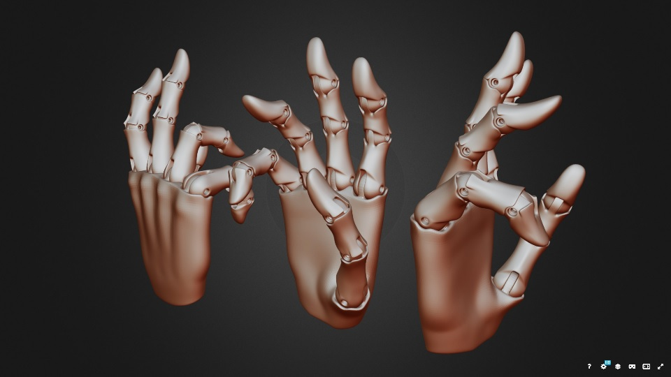

# Brainstorming Ideas

#### Contents
* **Brainstorming Ideas**<small> 
	&ndash; [Topology](#topology) 
	&ndash; [Sensors and feedback](#sensors-and-feedback) 
	&ndash; [Interface](#interface) 
	&ndash; [Visual](#visual) 
	&ndash; [Postures](#postures) 
	&ndash; [Documents](#documents) 
	&ndash; [Initially needed information](#initially-needed-information)</small>
* **Other Ideas**<small> 
	&ndash; [Grip lock](#grip-lock) 
	&ndash; [Grasp taxonomy](#grasp-taxonomy) 
	&ndash; [Shoulder control](#shoulder-control) 
	&ndash; [Automatic grip](#automatic-grip)</small>
* **References**<small> 
	&ndash; [Grasp reference](#grasp-reference) 
	&ndash; [Detailed hand](#detailed-hand)</small>

## Brainstorming Ideas

#### Topology
* T1. [**DONE**] Custom skeleton (e.g. model 1 individual finger, or a hand with 6 fingers)
* T2. [**DONE**] Custom shapes (e.g. different 3D shapes of body parts)
* T3. [**DONE**] Custom degrees of freedom in joints
* T4. [**DONE**] Custom ranges of joint rotations
* T5. Inverse kinematics
* T6. Soft tissue and deformations
* T7. Dependant motors (they retrieve orientation from another motor)

#### Sensors and feedback
* S1. [**DONE**] Custom positions of sensors
* S2. [**DONE**] Feedback from joint positions
* S3. [**DONE**] Collision detection with external objects
* S4. [**DONE**] Self-collision detection
* S5. [**DONE**] Visual feedback with color heatmaps
* S6. [**DONE**] Visual feedback with vectors
* S7. Visual feedback with tables/graphs
* S8. Gravity for gripped objects
* S9. [**DONE**] Velocity sensor
* S10. [**DONE**] Accelleration sensor
* S11. [**DONE**] Temperature sensor

#### Interface
* I1. Interface API for using from outside
* I2. [**DONE**] Programming control via API
* I3. [**DONE**] API for model definition
* I4. [**DONE**] API for model motion

#### Visual
* V1. [**DONE**] Interactive controls
* V2. Stock objects to grap and hold
* V3. [**DONE**] Importing GLTF body parts
* V4. Exporting GLTF models
* V5. Customs warning (aka virtual pain)
* V6. [**DONE**] VR mode (with VR headsets)

#### Postures
* P1. Mapping between input data and posture
* P2. [**DONE**] Predefined collection of postures
* P3. Predefined animations
* P4. [**DONE**] Scenes with several models
* P5. Self-balancing of pressure
* P6. [**DONE**] Predefined models (e.g. hands)
* P7. Self-learning mode
* P8. Macros mode (e.g. grip for rod, ball, cup; handshake, ...)

#### Documents
* D1. [**DONE**] GitHub project
* D2. [**DONE**] User documentation
* D3. Educational content
* D4. Academic papers
* D5. [**DONE**] Social network disseminations (e.g. videos)

## References

#### Grasp reference

A Sketchpad model of a human head making the sign language gestures for all
letters and digits is available at [Male Hands Alphabet Numbers](https://sketchfab.com/3d-models/male-hands-alphabet-numbers-a2ef72dee3b34a238910cae60816dc71).
It can be used as a reference so that to verify whether all these gestures can
be made with the virtual hand.

Additionally, The Japanese Sigh Language has a larger set of fingerspelling
gestures, shown in [Practice JSL Fingerspelling](https://www.kyoto-be.ne.jp/ed-center/gakko/jsl/zen_jsl04.htm)
or in [Japanese manual syllabary](https://en.wikipedia.org/wiki/Japanese_manual_syllabary)

#### Detailed hand

A Sketchpad model is a detailed 3D model of robotic hand. The license
is CC-BY, so it is possible to download it and test whether Virtual Robotics
can use this model. The model is [jointed hands BJD](https://sketchfab.com/3d-models/jointed-hands-bjd-25da42bebf7b4f70994e9f8f0e9fe1c5).

