# Virtual robotics

Modeling tool for virtual robotics body parts

* [Virtual robotics](docs/api.md)
* [Brainstorming ideas](docs/brainstorming-ideas.md)

## Examples

[<kbd></kbd>](examples/empty-scene.html)
[<kbd></kbd>](examples/simple-robot.html)
[<kbd></kbd>](examples/several-robots.html)
[<kbd>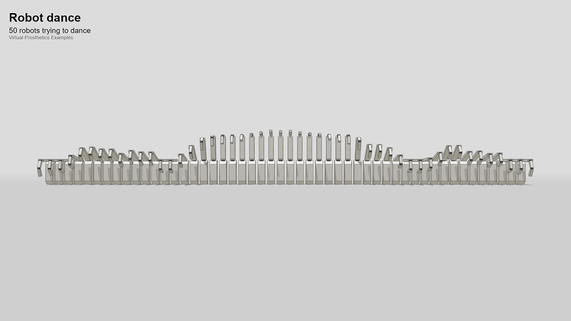</kbd>](examples/robot-dance.html)
[<kbd></kbd>](examples/two-hands.html)
[<kbd></kbd>](examples/distance-sensors.html)
[<kbd>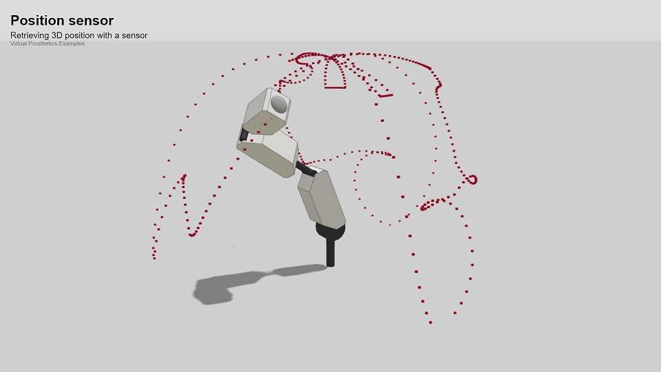</kbd>](examples/position-sensors.html)
[<kbd>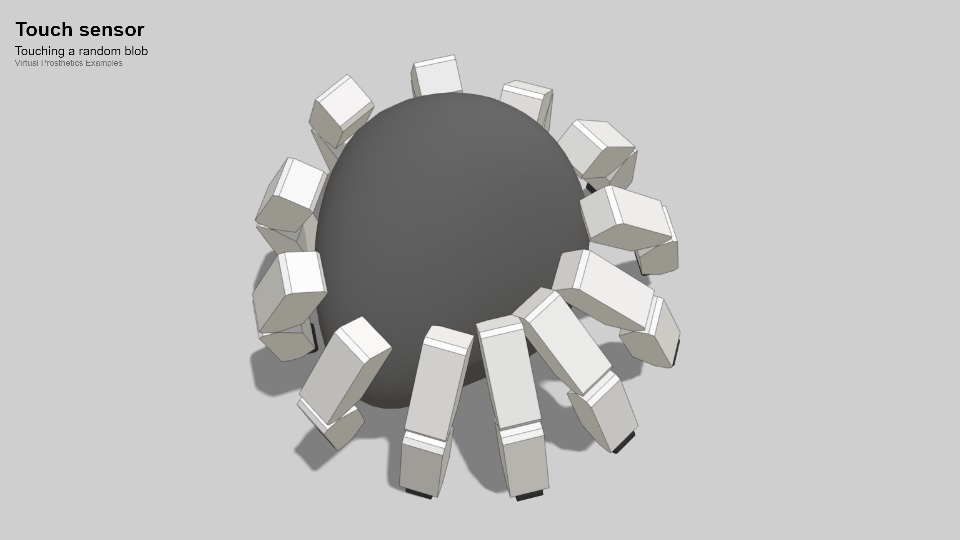</kbd>](examples/touch-sensors.html)
[<kbd>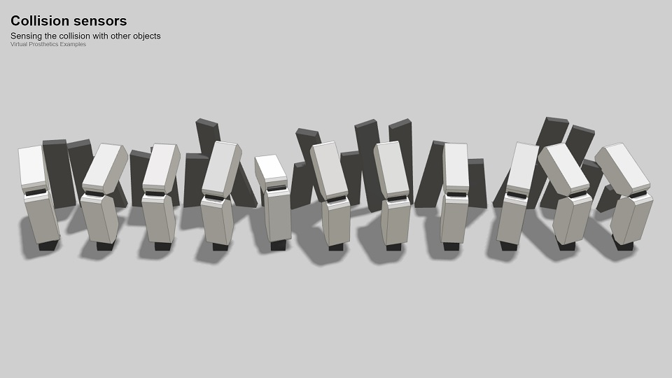</kbd>](examples/collision-sensors.html)
[<kbd></kbd>](examples/object-sensors.html)
[<kbd>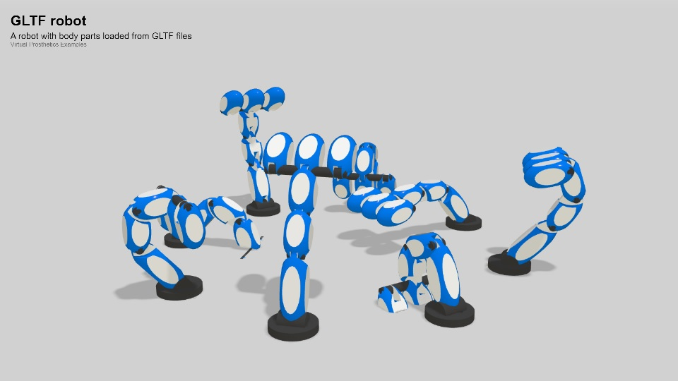</kbd>](examples/gltf-robot.html)
[<kbd>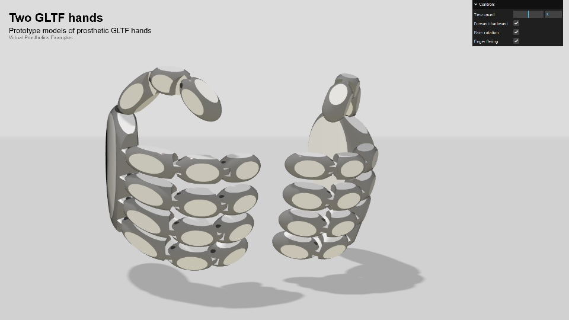</kbd>](examples/two-gltf-hands.html)
[<kbd>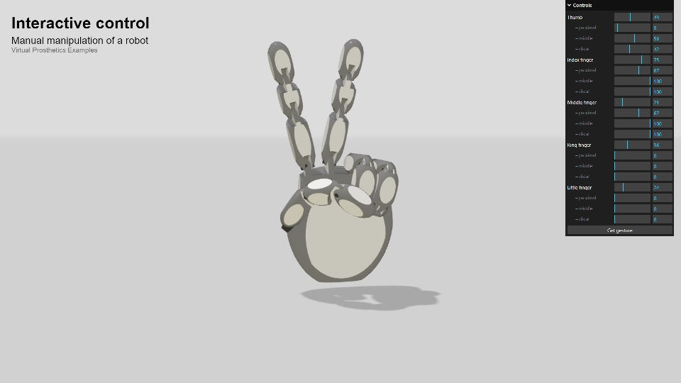</kbd>](examples/interactive-control.html)
[<kbd>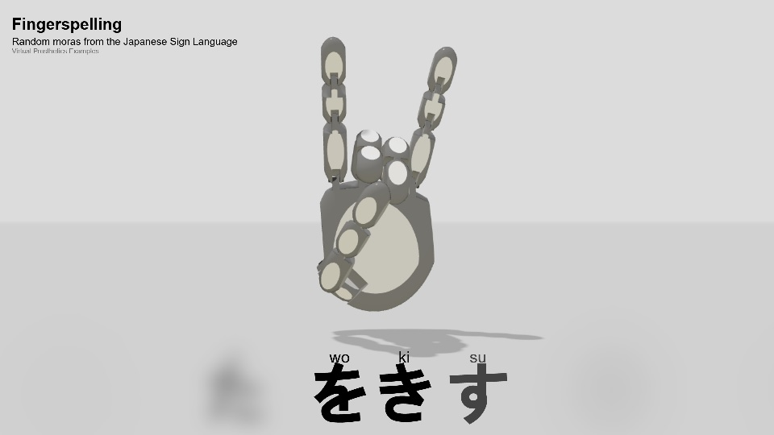</kbd>](examples/fingerspelling.html)
[<kbd>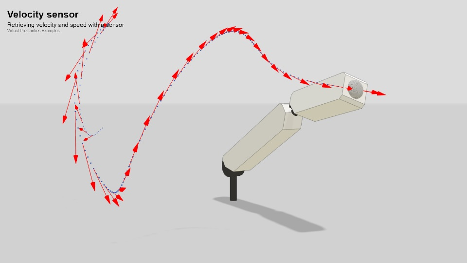</kbd>](examples/velocity-sensors.html)
[<kbd>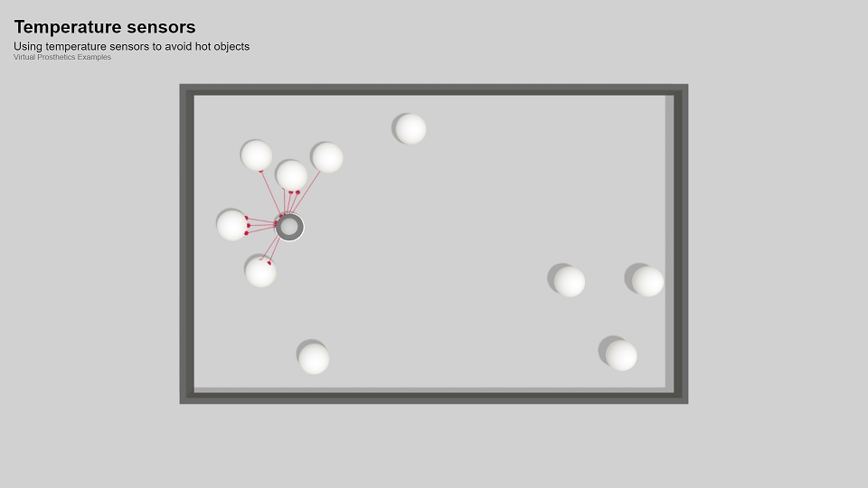</kbd>](examples/temperature-sensors.html)
[<kbd>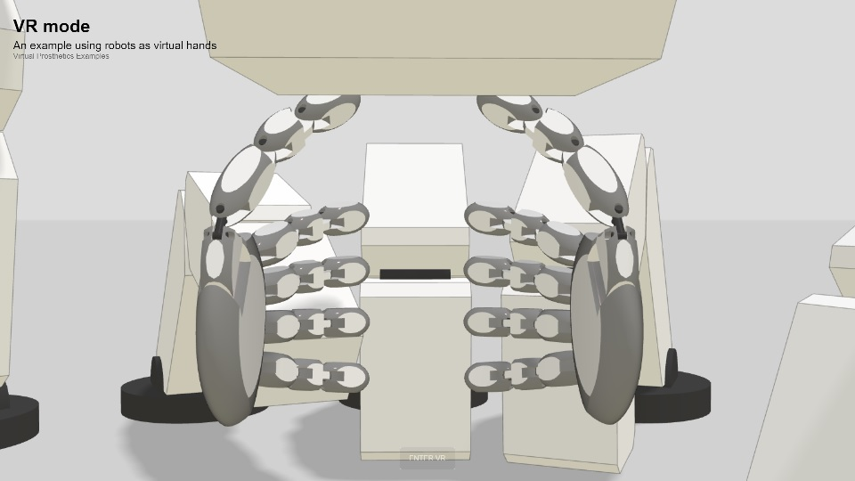</kbd>](examples/vr-mode.html)
[<kbd>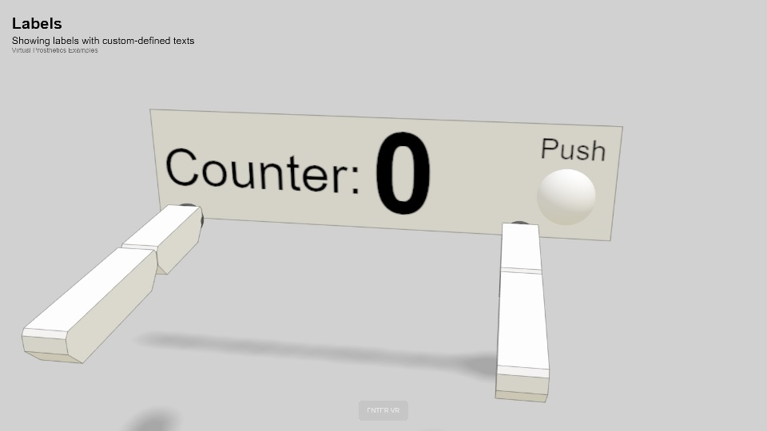</kbd>](examples/labels.html)

---

<small>March, 2024</small>